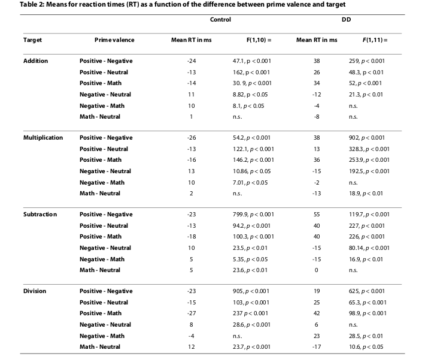

<html xmlns="http://www.w3.org/1999/xhtml" lang="en"><head>
<meta http-equiv="content-type" content="text/html; charset=UTF-8">
        <meta charset="UTF-8">
        <meta name="viewport" content="width=device-width, initial-scale=1.0">
      </head>
    <body>
        

            <h1>Mathematics anxiety in children with
                developmental dyscalculia</h1>
            
    
             
Orly Rubinsten*1 and Rosemary Tannock2,3
    
        

        

            <table border="0" align="justify">
                <tbody><tr>
                    <td width="50%">
                        
<b>Abstract</b>
                            <b>Background:</b> Math anxiety, defined as a
 negative affective response to mathematics, is known to have 
deleterious
                            effects on math performance in the general 
population. However, the assumption that math anxiety is directly 
related
                            to math performance, has not yet been 
validated. Thus, our primary objective was to investigate the effects of
 math
                            anxiety on numerical processing in children 
with specific deficits in the acquisition of math skills (Developmental
                            Dyscalculia; DD) by using a novel affective 
priming task as an indirect measure.

                            
<b>Methods:</b> Participants (12 children
 with DD and 11 typically-developing peers) completed a novel priming 
task in
                                which an arithmetic equation was 
preceded by one of four types of priming words (positive, neutral, 
negative or
                                related to mathematics). Children were 
required to indicate whether the equation (simple math facts based on
                                addition, subtraction, multiplication or
 division) was true or false. Typically, people respond to target 
stimuli more
                                quickly after presentation of an 
affectively-related prime than after one that is unrelated affectively.

                            
<b>Result:</b> Participants with DD responded faster to targets that were preceded by both negative primes and math-
                                related primes. A reversed pattern was present in the control group.

                                
<b>Conclusion:</b> These results 
reveal a direct link between emotions, arithmetic and low achievement in
 math. It is also
                                    suggested that arithmetic-affective 
priming might be used as an indirect measure of math anxiety.

                    </td>
                </tr>
            </tbody></table>
        

         
         
         
         
        

            <table border="0" align="justify">
                <tbody><tr>
                    <td width="50%" height="50%">
                        
<b>Background</b>
                            In today's high-tech, increasingly connected world, it is
                            vital that young children build confidence in their ability
                            to do mathematics, as deficiencies in this area can be a
                            major impediment to many facets of life. For example,
                            mathematical impairments have been shown to be func-
                            tionally significant for health numeracy [1,2], constrain-
                            ing informed patient choice and limiting access to
                            available treatments. Moreover, math impairments have a
                            negative influence on full-time employment in adulthood
                            [3].

                            
Mathematics anxiety [4] (henceforth, referred to as
                                'math anxiety'), is a negative reaction to math associated
                                with negative emotions. Specifically, math anxiety is a
                                state of discomfort occurring in response to situations
                                involving mathematics tasks that are perceived as threat-
                                ening to self-esteem [5]. It was claimed [6] that math anx-
                                iety manifests itself as an unpleasant emotional response

                                

                                
* Correspondence: orly.rubinsten@gmail.com
                                    1 Edmond J. Safra Brain Research Center for the Study of Learning Disabilities,
                                    Department of Learning Disabilities, University of Haifa, Israel
                                    Full list of author information is available at the end of the article

                    </td>
                    <td width="50%" height="50%">
                        
to math. In this vein, Beilock and colleagues [7] raised an
                            implicit argument that math anxiety is associated with
                            negative attitude towards math [see also [8]]. Others [9]
                            defined math anxiety as a feeling of tension, helplessness,
                            mental disorganization and dread produced when one is
                            required to manipulate numbers or to solve mathematical
                            problems. Indeed, the everyday intuition that math is
                            stressful has formal backing from the field of experimen-
                            tal psychology. For example, math is used as an experi-
                            mental stressor in studies that look at cardiovascular
                            activity [e.g., [10]].

                            
Several studies have found that math anxiety and math
                                achievement are negatively correlated [e.g., [6,8,11]]. It
                                was found [11] for example, that across junior and senior
                                high school, initial low math achievement is significantly
                                related to later high math anxiety, but initial high math
                                anxiety seems not to be strongly linked to later low math
                                achievement. In primary school children [8] however,
                                there was no clear developmental increase in the relation-
                                ship of math anxiety and calculation abilities. In a later
                                publication [12] a structural equation modeling found no
                                effect of math anxiety on calculation ability. In the cur-

                    </td>
                </tr>
            </tbody></table>
        

         
         
         
                 
        

            <table border="0" align="justify">
                <tbody><tr>
                    <td width="50%" height="50%">
                        
rent study, our premise is that in Developmental Dyscal-
                            culia (DD; a deficit in processing numerical information)
                            poor initial math abilities may precede and give rise to
                            math anxiety, creating a vicious cycle.

                            

                            In the present study, we show that math anxiety (1) is
                            distinguishable from other types of anxiety symptoms
                            (i.e., math anxiety can exist in the absence of more gen-
                            eral anxiety traits); and (2) has a direct and deleterious
                            effect on underlying cognitive processes as the individual
                            performs a math task. We also show that this is especially
                            true for individuals with DD. Prior to outlining our
                            hypotheses and describing our study, we first highlight
                            important developments in the understanding of math
                            anxiety and dyscalculia.

                            
<b>Math anxiety</b>

                                

                                Although not clearly discussed or scientifically studied,
                                math anxiety is thought as specific to math context and
                                therefore distinct and occurring in the absence of gener-
                                alized anxiety [e.g., see [13] who extended Eysenck &amp;
                                Calvo's [14] predictions about generalized anxiety and
                                working memory to math anxiety]. Accordingly, math
                                anxiety seems to be a very prevalent phenomenon
                                approaching, for example, 4% of high school students
                                [15].

                                

                                Reasons for math anxiety are usually classified as envi-
                                ronmental, personal, or cognitive [16]. Environmental
                                causes can include negative experiences in math classes
                                or with particular math teachers [e.g., [17]]. Personal
                                causes include low self-esteem, lack of confidence and the
                                influence of previous negative experiences with mathe-
                                matics [e.g., [18]]. Cognitive causes involve innate charac-
                                teristics, being either low intelligence or simply poor
                                cognitive abilities in mathematics [17]. Presently, we
                                focus on the cognitive cause of math anxiety.

                                

                                As noted above, there is evidence that math anxiety and
                                math achievement are negatively correlated [e.g.,
                                [6,8,11]]. Very recently, Beilock and colleagues [7] have
                                shown that girls' math achievement (but not boys') are
                                influenced by their teachers math anxiety. If we wish to
                                disentangle the relationship between the two, math
                                achievement and anxiety, a logical first research step is to
                                study math anxiety in individuals who suffer from low
                                math abilities from very early in life (i.e., those with DD).
                                To our knowledge, the relationship between math anxiety
                                and developmental dyscalculia has received no formal
                                attention from researchers, educators or clinicians. In the
                                present paper, we aim to determine the precise relation-
                                ship between math anxiety and DD.

                                
<b>Developmental Dyscalculia</b>

                                

                                    Developmental Dyscalculia (DD) describes a specific and
                                    severe deficit in the ability to process numerical informa-
                                    tion that cannot be ascribed to sensory difficulties, low
                            
                    </td>
                    <td width="50%" height="50%">
                        
IQ or inadequate education, and that results in a failure
                            to develop fluent numerical computation skills [19,20].
                            Untreated, DD typically persists beyond the school-age
                            years into late adolescence and adulthood [21,22]. Epide-
                            miological studies indicate that DD is as common as
                            reading disorders and affects 3.5% - 6.5% of the school-
                            age population [20]. Moreover, DD runs in families and is
                            heritable, which implicates genetic factors in its etiology,
                            though to date none have been reported [23,24].

                            

                            More recently, DD has been understood to reflect defi-
                            ciency mainly (but not only) in brain regions of the pari-
                            etal cortex along the intraparietal sulcus (IPS). IPS
                            deficiencies can be found at the structural [25,26] and the
                            functional levels (e.g., [DD in children [27-29], DD in
                            adults [30,31]]) alike. The IPS is considered to be involved
                            with an abstract, amodal representation of numbers [32-
                            34] and is activated by numbers presented in different
                            culturally learned symbolic notations such as Arabic
                            numerals and spoken number words [35]. Accordingly,
                            and despite indecisiveness in the existent development
                            brain imaging studies on DD (e.g., for group differences
                            on non-symbolic number processing in children with DD
                            see [29] vs. no such difference in [28]), to date the IPS is
                            the best validated core deficit of DD [21].

                            

                            A range of terms are used to refer to problems in learn-
                            ing mathematical concepts and skills, including Math
                            Difficulties, Math Disability, Mathematical Learning Dis-
                            ability, Mathematics Disorder, Specific Disorder of Arith-
                            metic Skills, Math Anxiety, and DD. These terms are
                            similar in that all implicate low numeracy skills. However,
                            they are not synonymous [19,36]. Here we differentiate
                            general Mathematics Disorder [MD: e.g., DSM-IV: [37]]
                            from Developmental Dyscalculia in several important
                            ways. In DD, the learning problem: 1) is specific to the
                            domain of arithmetic (reading and spelling skills are
                            within the normal range); 2) manifests partly as problems
                            in learning and remembering simple arithmetic facts
                            (such as single-digit sums or products; e.g., 3+4 = 7),
                            rather than more general problems in computation; 3) is
                            typically defined by very low scores on standardized tests
                            of arithmetic achievement, e.g., below the 8th or even 5th
                            percentile, which is equivalent to standard scores below
                            78 [38]; and 4) reflects a specific impairment in brain
                            function that gives rise to unexpected problems in basic
                            numerical processing, such as automatic or implicit pro-
                            cessing of quantities or numbers [[28,30,39], e.g., [40-
                            43]].

                            

                            Further evidence of the distinction between DD and
                            low numeracy is provided by our research, which shows
                            the effects of a stimulant (methylphenidate) on arithmetic
                            problem solving in children with ADHD+DD versus
                            ADHD+ low numeracy. The drug had no influence on a
                            basic understanding of numerical magnitude, which was
                            impaired in the former but not the latter group [44]. It

                        </td>
                </tr>
            </tbody></table>
        

         
         
         
                 
        

            <table border="0" align="justify">
                <tbody><tr>
                    <td width="50%" height="50%">
                        
should be noted, as well, that the common symptom of
                            poor memory for arithmetical facts in DD is not neces-
                            sarily part of a wider impairment in either long-term or
                            working memory [45,46].
                            The present study focuses on the narrower phenotype
                            of DD rather than the broader diagnostic category of MD,
                            since it is believed that the etiology of DD is distinct from
                            that of other math difficulties [19,47]. As noted above, it
                            was shown [48] that initial low mathematics achievement
                            is related to later high mathematics anxiety (though pri-
                            marily for boys; for girls this was true at critical transition
                            points only). Although the relationship between math
                            anxiety and DD has not yet been scientifically studied,
                            Ma and Xu's findings [46] suggest that children with DD
                            may find daily math lessons a source of huge anxiety, as
                            they must exert tremendous effort to understand what is
                            obvious to their classmates. This leads to our main
                            hypothesis, namely, that DD is strongly associated with
                            math anxiety. Our approach to this question combines
                            the field of math anxiety [4] with that of mathematical
                            cognition [49], which focuses on the underlying mental
                            representations and processes used in arithmetic and
                            mathematics performance.

                            
<b>Affective priming and the current study</b>

                            

                                Typically, evidence shows significant deficiencies in per-
                                formance as a function of math anxiety only when com-
                                plicated arithmetic problems are tested [e.g., [50]]. These
                                deficiencies have not been observed in simple operations
                                such as single-digit addition or multiplication (e.g., 7 + 9,
                                6 X8), probably since the findings are usually based on
                                paper-and-pencil behavioral tests that involve higher-
                                level cognitive processes [e.g., [9]]. In the present study,
                                we use a novel implicit low-level cognitive task [i.e., affec-
                                tive priming: for review see 51] to study math anxiety and
                                its effects on math performance. We also use this task to
                                study the differences between children with Develop-
                                mental Dyscalculia and normally developing children.
                                It has been shown that affective traits can be activated
                                automatically and influence emotional, cognitive or
                                behavioral processes [e.g., [52]]. That is, affective pro-
                                cessing starts immediately and even involuntarily upon
                                seeing a salient affective word or picture. Psychologists
                                use situations where implicit processing is possible in
                                order to study automaticity. One such task is the priming
                                task in which an early stimulus that is designed to be
                                ignored influences the response to a subsequent relevant
                                stimulus. In many cases, participants cannot ignore the
                                irrelevant dimension (the prime), which facilitates or
                                interferes with processing the relevant one (the target).
                                In line with these findings, affective priming studies
                                have demonstrated that people respond to target stimuli
                                more quickly after presentation of an affectively related
                                prime stimulus than after one that is affectively unrelated,

                    </td>
                    <td width="50%" height="50%">
                        
whether the target involves written words or not [for
                            review see [51], e.g., naming target' written words:
                            [53,54], naming or categorizing pictures: [55]].
                            One hypothesis is that affective priming works because
                            affective polarized prime stimuli pre-activate the mem-
                            ory representation of affectively related targets [e.g., [56-
                            58]]. For example, in naming tasks, words are automati-
                            cally retrieved from verbal memory. This memory
                            retrieval is influenced by the emotional prime through
                            emotional coding associated with the target words [59].
                            In the present study, we ask whether single-digit arithme-
                            tic problems can be affectively primed in the same way.
                            For example, it has been shown that with increasing prac-
                            tice or skill, children and adults automatically retrieve the
                            solutions to simple addition [e.g., 3 + 4 = 7: [60,61]] and
                            multiplication math problems [e.g., 3 × 4 = 12: [62,63]]
                            from verbal memory as the strategy of choice and do not
                            involve quantity processing. In contrast, single-digit sub-
                            traction and, sometimes, simple division appear to acti-
                            vate a distinct neural network that includes the inferior
                            parietal lobule, left precuneus, and left superior parietal
                            gyrus [64], suggesting that subtraction requires manipu-
                            lation of mental quantities that is not automatic or
                            implicit [65-68]. Recently, though, it has been shown [69]
                            that in cases of very simple arithmetic operations pre-
                            sented with Arabic digits (as in the current study), most
                            participants report using retrieval from memory as a
                            strategy of choice not only for addition and multiplication
                            but also for division and subtraction (about 82% use
                            retrieval from memory for addition, 92% for multiplica-
                            tion, 80% for division and 73% for subtraction). It is not
                            yet clear, however, to what extent simple addition or mul-
                            tiplication problems are affectively represented in verbal
                            memory.
                            Accordingly, we developed for this study a novel task
                            with four different types of primes (words with positive,
                            neutral, and negative affect, as well as words related to
                            mathematics) with single-digit arithmetic problems as
                            targets. In our task, participants were simply required to
                            decide if the target was true or false. This is similar to
                            previous affective priming tasks in which participants
                            were told to categorize the target as positive or negative
                            [e.g., [59]]. It is hypothesized that in such cases, the affec-
                            tive priming effect is produced by processes that operate
                            at a response selection level. Specifically, whenever a
                            prime is affectively related to a target (e.g., both are posi-
                            tive), its valence will also match the valence of the
                            response that is required (e.g., "positive," or in the current
                            work, "true") [e.g., [59,70]]. Since it is not clear if emo-
                            tional priming will influence math problems at the level
                            of retrieval from verbal memory or at the level of
                            response selection of computational procedures, we
                            chose methodological parameters that have been proven

                    </td>
                </tr>
            </tbody></table>
        

         
         
         
         
        

            <table border="0">
                <tbody><tr>
                    <td width="50%" heigh="50%">
                        
to influence both levels [59] - namely, short stimulus
                            onset asynchrony (SOA).
                            We use this novel arithmetic-affective priming task to
                            study math anxiety, focusing on how the presentation of
                            mathematical word-primes such as "multiplication" or
                            "quantity" influences the ability to solve simple arithmetic
                            problems, and how these math words compare in their
                            effects to negative, positive, or neutral words. Impor-
                            tantly, we also study how performance of this task differs
                            between children with DD and normally developing con-
                            trols.

                            

                            As noted above, in the current study we argue that
                            math anxiety is related to poorer math performance, per-
                            haps through the mechanism identified by Ashcraft and
                            Kirk [see also [48,71]], who showed that the effect of
                            math anxiety on performance is mediated by working
                            memory. For this reason, we measured math anxiety
                            solely through the arithmetic-affective priming paradigm
                            (as opposed to using tools such as a math anxiety ques-
                            tionnaire). We used the Revised Manifest Anxiety Scale
                            (RCMAS-2) [72] to measure general anxiety traits so as to
                            distinguish those from math anxiety symptoms.

                            

                            In this study, we used our novel affective-priming tool
                            to address three hypotheses. We predicted that (1) a
                            direct link would appear between emotions (primes) and
                            arithmetic problem solving (targets); (2) compare to con-
                            trols, DD will respond faster to targets that are preceded
                            by negative affective primes that, in this group, will act as
                            affectively related primes; and (3) math primes (e.g.,
                            words like "quantity") will have the same effect as the neg-
                            ative affective primes (i.e., acting as an affectively related
                            primes) in the DD group but not in the controls, at least
                            for some of the arithmetic problems (i.e., targets).

                            
<b>Method 
                                Participants</b>

                                

                                A total of 36 children (aged 7 to13 years; 58% female) and
                                their parents agreed to participate. Of these, 18 (50%) met
                                our criteria for DD (see also Table 1). The DD and control
                                groups were matched for age, IQ, reading ability and gen-
                                der. Among the 36 participants, only 23 (12 with DD and
                                11 controls) completed all the trials (13 decided to quit
                                before the task ended) in the arithmetic-affective priming
                                task. These children comprise the final study sample. All
                                participants in the final sample were in grades 4 or above.
                                Both groups of children were recruited from two pri-
                                vate schools in Canada, which accepted students with
                                severe mathematical learning difficulties, as well as typi-
                                cally achieving students. Teachers were asked to nomi-
                                nate students who they believed were of average general
                                ability but had serious difficulties with numeracy. For
                                each child classified as having DD (according to assess-
                                ment criteria described below), we recruited a typically

                    </td>
                    <td width="50%" height="50%">
                        
achieving student of same age and gender from the same
                            class.
                            General inclusion/exclusion criteria
                            All children spoke English as their primary language,
                            attended school full time, had no uncorrected sensory or
                            physical impairments (which would preclude participa-
                            tion in the computerized or paper-and-pencil testing),
                            and no current or previous history of psychosis or other
                            mental health disorders (e.g., ADHD, Anxiety, or Depres-
                            sion) that might influence cognitive performance.
                            Classification of DD (see Appendix 1 for description of
                            classification measures)
                            To be classified as having DD, children had to meet the
                            following three criteria:
                            (1) at least average general ability, as indexed by stan-
                            dardized scores of at least 85, or 16th percentile, on the
                            Kaufman Brief Intelligence Test (K-BIT2) [73];
                            (2) a learning problem specific to the domain of arith-
                            metic, as shown by scores of normal range (≥ 85, or 16th
                            percentile) on three standardized reading tests - Word
                            Attack, Letter-Word Identification, and Reading Fluency -
                            from the Woodcock-Johnson Tests of Achievement, 3rd
                            Edition (WJ-III) [74];
                            (3) impaired numeracy skills as indexed by standard-
                            ized scores ≤ 81 (below 10th percentile) or a stanine score
                             3 on at least one of two subtests of the WJ-III (Math
                            Computation and Math Fluency) and on at least one of
                            the two subtests from the Dyscalculia Screener [75]: Dot
                            Enumeration and Number Comparison, which are con-
                            sidered core subtests for identifying DD [47,75];
                            (4) no signs for generalized anxiety traits according to
                            the Revised Manifest Anxiety Scale (RCMAS-2).
                            (5) no signs of working memory impairments according
                            to Cambridge Neuropsychological Testing Automated
                            Battery (CANTAB) and letter span.
                            To be classified as typically achieving controls, children
                            had to meet the following three criteria:
                            (1) no parent or teacher concerns regarding academic
                            achievement, attention, or behavior (as indexed by the
                            Academic Screening Rating Scale [76];and SWAN rating
                            scale [77];
                            (2) at least average general ability, as indexed by stan-
                            dardized scores of at least 85 or 16th percentile, on the K-
                            BIT2 [73];
                            (3) At least average reading and numeracy skills as
                            indexed by standardized scores of at least 85 (above 16th
                            percentile) or a stanine score of at least 4 on the two read-
                            ing tests together with four math tests described above
                            (i.e., score of 85 and above was required on all 6 tests);
                            (4) no signs for generalized anxiety traits according to
                            the Revised Manifest Anxiety Scale (RCMAS-2).
                            (5) no signs of working memory impairments according
                            to Cambridge Neuropsychological Testing Automated
                            Battery (CANTAB) and letter span.

                    </td>
                </tr>
            </tbody></table> 
        

        

            
        

         
         
         
         
        

            <table border="0">
                <tbody><tr>
                    <td width="50%" height="50%">
                        
<b>Arithmetic-affective priming task 
                            Stimuli</b>

                            

                            that there are no norms for emotional values of mathe-
                            matical words.
                            Each trial consisted of a prime (one of the four types of
                            affective words) and target (simple arithmetic equation)
                            that appeared sequentially. Both prime and target
                            appeared horizontally at the center of a computer screen
                            in black characters against a white background. Each
                            character was printed in boldface in Ariel font, size 18.Targets

                            
<b>Primes</b>

                            

                            A list of 40 words (10 negative, 10 positive, 10 neutral,
                            and 10 mathematics words) comprised the primes (see
                            Appendix for details of the primes). Valences for the
                            emotional and neutral words were taken from Vasa and
                            colleagues' data [78]. Word frequencies shown in the
                            Additional file 1 (Appendix 2) are taken from [79] and,
                            for the emotional and neutral words, also from [80]. Note

                    </td>
                    <td width="50%" height="50%">
                        
that there are no norms for emotional values of mathe-
                            matical words.

                        
<b>Targets</b>

                        
Equations were presented in the form "a * b = c ", where a
                            and b represented single digits from 1 to 9, * represented
                            an arithmetic operation (×, +, -, or ÷), and c represented
                            the solution. We employed for a and b all possible pairs of
                            digits from 1 to 9 such that (1) regardless of the arithme-
                            tic operation used, the solution to the equation is a posi-
                            tive integer; and (2) the four arithmetic operations
                            produce different solutions. For example, 7 * 3 and 5 * 4
                            were excluded because in these cases, division results in a
                            solution that is not an integer. Likewise, we excluded
                            equations such as 3 * 1, where multiplication and division
                            produce the same result, and 4 * 2, where this is true for
                            division and subtraction. Five pairs of digits meet both

                    </td>
                </tr>
            </tbody></table>
        

         
         
         
         
        

            <table border="0">
                <tbody><tr>
                    <td width="50%" height="50%">
                        
criteria (9 * 3, 8 * 4, 8 * 2, 6 * 3, and 6 * 2), and so these
                            pairs were included in the experimental blocks. For all
                            stimuli, the numerically larger digit was presented on the
                            left side.

                            

                            We created two types of solution conditions as follows:
                            (1) the true condition comprised 20 equations with true
                            results according to the criteria described above (e.g., 8 ×
                            4 = 32); (2) for each of the 20 true equations we created
                            three false equations by borrowing the solution to
                            another equation (as long as this solution was not the
                            same as a or b, i.e., a digit belonging to the arithmetic fact
                            itself ). For example, for the stimulus 8 × 4, we created
                            false equations with the solutions 27, 10 and 3, which are
                            true results for 3 × 9, 8 + 2 and 6 ÷2, respectively. (See
                            Additional file 1: Appendix 3 for the target arithmetic
                            problems).

                            

                            Each participant underwent 160 trials using the 40
                            primes four times each, twice with a true equation as the
                            target and twice with a false equation. For the true condi-
                            tion, each prime appeared with two different true equa-
                            tions that were pseudo-randomly selected such that any
                            given true equation appeared only once for each group of
                            10 primes. This produced a total of 80 true equations.
                            For the false condition, each prime appeared with two
                            different false equations, which again were pseudo-ran-
                            domly selected such that any given false equation
                            appeared once in each group of 10 primes. This produced
                            a total of 80 false equations. The distribution of false
                            equations was designed such that each participant saw
                            only one of the three different false equations that had
                            been created for every true one, but that all the false
                            equations were used. In other words, the full set of 60
                            false equations was seen by each set of three participants
                            together.

                            

                            The following two variables were included in the analy-
                            sis: group (DD vs. control), prime (negative, positive, neu-
                            tral, and math), and target's arithmetic operation (+, -, ×,
                            ÷). Thus, we had a 2 × 4 × 4 factorial design. Group was
                            the only between-participants variable and primes and
                            targets were manipulated within block.

                            

                            Before the experiment began, participants completed a
                            practice phase with eight primes (see Additional file 1:
                            Appendix 4) and eight equations, four true and four false
                            (see Additional file 1: Appendix 3). The primes and equa-
                            tions were different from those used in the experiment
                            itself.

                            
<b>Procedure</b>

                            

                            Stimuli were presented on a computer screen at a dis-
                            tance of approximately 60 cm from participants. Partici-
                            pants were told that they were about to participate in a
                            simple arithmetic experiment and that a word and simple
                            arithmetic problem would be sequentially presented on
                            the computer screen. They were instructed to decide if

                    </td>
                    <td width="50%" height="505">
                        
the arithmetic problem was correct or not as quickly as
                            possible while ignoring the word. Reponses were made by
                            pressing one of two possible keys.

                            

                            Each trial opened with a 500 millisecond (ms) presenta-
                            tion of a fixation cross in the center of the computer
                            screen. Five hundred milliseconds after offset of the fixa-
                            tion cross, the prime words were presented for 250 ms.
                            The target arithmetic equation followed an offset of the
                            prime words, resulting in a stimulus onset asynchrony
                            (SOA) of 250 ms. The target equations were displayed
                            until the participant responded "correct" or "not correct"
                            by pressing one of two keys on the keyboard (the letters
                            "p" or "q"), or until 3,000 ms had elapsed. The correct
                            solution was represented by the letter "p" for 14 partici-
                            pants and the letter "q" for the other nine. The next trial
                            was initiated 2,000 ms after the participant's response.
                            Reaction time (RT) in milliseconds was measured by the
                            computer from the stimulus onset to the participant's
                            response.

                            
<b>Results</b>

                            

                            Incorrect responses (3.3%) were discarded from the anal-
                            ysis. Also, to reduce the impact of outliers, response
                            latencies that deviated more than 2.5 standard deviations
                            from the participant's conditional mean latency (0.7%)
                            were discarded, as well. An accuracy analysis demon-
                            strated that the number of errors made by the DD group
                            did not differ significantly from those made by the con-
                            trol group, F(1,10) = 4.566, p = 0.058. Also, the correla-
                            tion between error rates and RT was positive r = 0.4399, p
                            0.05 thereby, excluding any speed-accuracy tradeoff.
                            The main effects of group (DD: M = 977.8 ms, S.D. =
                            29.8 ms; Control: M = 844 ms, S.D. = 20.1 ms); F(1,21) =
                            2541, p 0.001, type of prime (positive primes: M = 920.7
                            ms, S.D. = 89.9 ms; neutral: M = 912.3 ms, S.D. = 69.3 ms;
                            negative: M = 912 ms, S.D. = 61.41 ms; math: M = 909 ms,
                            S.D. = 63.24 ms; F(3,63) = 31, p 0.001) and arithmetic
                            operation (i.e., target; addition: M = 896.6 ms, S.D. =
                            66.64 ms; multiplication: M = 899.9 ms, S.D. = 67.96 ms;
                            subtraction: M = 923.2 ms, S.D. = 70.62 ms; division: M =
                            935.5 ms, S.D. = 74.9 ms; F(3,63) = 43.2, p 0.001),
                            reached significance.

                            

                            Of primary relevance to the aims of the current study
                            was the significant interaction between group, type of
                            prime and arithmetic operation, F(9,189) = 10.4, p 0.001
                            (see Table 2). Planned comparisons, based on our initial
                            hypothesis, confirmed that the simple interaction
                            between type of prime × arithmetic operation was signifi-
                            cant in the control group, F(9,90) = 4.06, p 0.01, as well
                            as in the DD group, F(9,99) = 9.43, p 0.001. However, as
                            predicted, further planned comparisons showed that dif-
                            ferential priming (relatedness) effect was obtained in the
                            priming data. Specifically, analysis revealed an affective
                            priming effect i.e., positive affective primes vs. negative

                    </td>
                </tr>
            </tbody></table>
        

        

            
        

         
         
         
         
        

            <table border="0">
                <tbody><tr>
                    <td width="50%" height="50%">
                        
affective primes) in the control group. That is, a signifi-
                            cantly shorter response latencies for positive as compared
                            to negative affective primes was found in the control
                            group (i.e., positive affective primes tend to act as affec-
                            tively related to simple arithmetic problems) when targets
                            were addition problems, F(1,10) = 47.1, p 0.001; multi-
                            plication, F(1,10) = 54.23; p 0.001, subtraction, F(1,10) =
                            799.9, p 0.001; and division problems, F(1,10) = 905, p 
                            0.001(see Table 2 for further details).

                            

                            An affective priming effect was found in the DD group,
                            as well, but with a reversed pattern. That is, significantly
                            shorter response latencies were observed in the DD
                            group for negative as compared to positive targets (i.e.,
                            negative affective primes act as affectively related to sim-
                            ple arithmetic problems) when targets were addition
                            problems, F(1,11) = 259.2, p 0.001; multiplication,

                    </td>
                    <td width="50%" height="50%">
                        
F(1,11) = 902; p 0.001, subtraction, F(1,11) = 1197, p
                            0.001; and division problems, F(1,11) = 625, p 0.001.
                            Accordingly, the affective priming effect in the DD group
                            (i.e., related\negative primes vs. unrelated\positive
                            primes) is different from that found in the control group
                            (i.e., related\positive primes vs. unrelated\negative
                            primes)

                            

                            We further contrasted the results for the four different
                            primes in relation to each arithmetic operation for each
                            group (see Table 2 and Figure 1). In general, we found
                            that in the DD group there was no significant difference
                            between negative and math primes for addition and mul-
                            tiplication. Furthermore, in the case of division, math
                            prime words facilitated processing even more than the
                            negative prime words target's RTs were shorter after pre-
                            sentation of math prime words compared to negative

                    </td>
                </tr>
            </tbody></table>
        

        

            
        

        

            <table border="0">
                <tbody><tr>
                    <td width="50%" height="50%">
                        
prime words) and hence, acted as affectively related to
                            targets (even more than negative emotional primes). Sup-
                            porting this last claim is the finding that in all 4 arithme-
                            tic procedures, math prime words significantly facilitated
                            processing compared to positive prime words. An oppo-
                            site pattern was <b>found in the control group:</b> In 3 arith-
                            metic procedures (addition, multiplication and
                            subtraction) responding to targets were faster after the
                            presentation of math prime words compared to the pre-
                            sentation of negative prime words but still significantly
                            slower compared to when being presented after positive
                            prime words. In the case of division (in the control
                            group), math prime words inhibited processing (i.e.,
                            response latencies to targets were shorter after presenta-
                            tion of math prime words as in the case of negative prime
                            words) and hence, acted as affectively unrelated to targets
                            similar to negative emotional primes. Hence, in the con-
                            trol group, math prime words acted as an affectively
                            unrelated to targets. In addition, in the control group we
                            found no significant difference between neutral and math
                            word primes for addition and multiplication.

                            
<b>Discussion</b>

                            

                            Data from behavioral and cognitive studies with typically
                            developing participants have long implicated the role of
                            low self esteem and anxiety in arithmetic and math [[48],
                            e.g., [71]]. It appears that poor math achievement is
                            strongly related to math anxiety [6-8,11,48,50]. However,
                            there has thus far been no direct evidence linking math
                            anxiety with deficiencies in basic numerical abilities (e.g.,
                            retrieval of arithmetic facts). In the present study, we
                            evaluated the relationship between math abilities, math
                            anxiety and simple arithmetic problems by using novel
                            arithmetic-affective priming during simple arithmetic
                            problem solving. Analyses of the data revealed that par-
                            ticipants with DD responded faster to targets that were
                            preceded by both negative primes and math-related
                            primes. A reversed pattern was present in the control

                    </td>
                    <td width="50%" heigth="50%">
                        
group. We found this effect for each of the arithmetic
                            procedures (multiplication, addition, subtraction and
                            division), thereby uncovering a direct link between emo-
                            tion and simple arithmetic problem solving, and more
                            specifically, between negative emotions and deficits in
                            simple arithmetic problem solving in cases of DD. More-
                            over, we also found simple arithmetic problem solving to
                            be modulated by words that are related to math (e.g.,
                            "quantity"). In the DD group math words and negative
                            affective primes had a significantly similar effect on tar-
                            gets. Specifically, in both addition and multiplication
                            problems as targets, math prime words had precisely the
                            same facilitative influence as negative affective words.
                            Moreover, in all four procedures, math prime words facil-
                            itated target processing in a similar fashion as the influ-
                            ence of negative primes (in divisions, facilitation effect
                            was even stronger). This suggests that these math words
                            are affectively related to targets (which are loaded by neg-
                            ative affect). However, in the control group, math words
                            inhibited processing. Specifically, in both addition and
                            multiplication problems as targets, math prime words
                            had the same influence as neutral affective words; and in
                            all four procedures math prime words inhibit processing
                            similar (or even more) to the influence exerted by the
                            negative affective primes. This suggests that, in the con-
                            trol group, these math words are affectively unrelated to
                            targets (which may be loaded by neutral affect).

                            
<b>Math anxiety and math achievement</b>

                            

                            The main contribution of the current work is that it pro-
                            vides significant support for the proposed relationship
                            between math anxiety and math achievement [e.g., [17]].
                            We found a strong relationship between DD (i.e., severe
                            math difficulties) and fear, especially when children in
                            this group were required to decide quickly whether prob-
                            lems in all four procedures were correct or not.
                            The following is only a suggested hypothesis, since the
                            current analysis cannot point directly to a causal connec-

                    </td>
                </tr>
            </tbody></table>
        

        

            <table border="0">
                <tbody><tr>
                    <td width="50%" height="50%">
                        
ion between math anxiety and math achievement.
                            Rubinsten and Henik [19] have recently suggested frame-
                            works to link the behavioral-cognitive deficits associated
                            with DD to their potential neural foundations. In general
                            research suggests that DD has a clear biological source
                            and reflects deficiency mainly in brain regions of the
                            parietal cortex along the IPS. Hence, and if DD is a herita-
                            ble, genetically-based condition [e.g., see recent genetic
                            study by [81]], then youngsters with DD likely suffer from
                            low numerical abilities from a very early age. This
                            strongly suggests that low math achievement due to DD
                            will lead to math anxiety. To some extent, our findings
                            support Ma and Xu's [48] data, suggesting that math anx-
                            iety springs from the unpleasant memory of poor mathe-
                            matics performance in the past. Accordingly, it seems
                            reasonable to assume that most of the evaluative reac-
                            tions towards math are learned rather than innate.
                            According to our data, there is clear evidence that, for
                            DD, math words had an anxious influence mainly when it
                            comes to addition and multiplication arithmetic prob-
                            lems. What may be some of the reasons for this phenom-
                            enon? Normally developing children enter school with
                            informal knowledge about numbers and arithmetic;
                            knowledge that is based on their daily experiences of
                            counting and calculation. Once entering school, however,
                            much educational training is focused on basic multiplica-
                            tion and addition arithmetic facts [82]. Consider, how-
                            ever, a child with DD who is innately deficient in his/her
                            ability to process numbers, to count and to calculate. This
                            child, from a very young age, has to answer addition and
                            multiplication questions for which there is almost always
                            only one correct answer. This situation, combined with
                            the culture of solving these problems quickly, can lead
                            students with DD towards a negative attitude style and
                            ultimately learned helplessness to arithmetic in general
                            (i.e., the affectively related influence that negative affec-
                            tive words had on solving simple arithmetic problems).
                            Also, this situation can lead to a specific and accentuated
                            fear and avoidance when it comes to retrieval of addition
                            and multiplication problems from memory (i.e., the affec-
                            tively related influence that math words had on solving
                            mainly multiplication and addition problems). Recently,
                            Ischebeck and colleagues [83] found that untrained com-
                            plex multiplication problems produce activation in sev-
                            eral frontal and parietal brain areas. With training,
                            activation shifts to the left angular gyrus, known to be
                            involved in retrieval of arithmetic facts. Importantly and
                            with relevance to the current study, only division prob-
                            lems (that were not trained) that are related to the trained
                            multiplication problems showed also activation in the left
                            angular gyrus. This may suggest that there is a transfer of
                            knowledge and procedure form multiplication to divi-
                            sion. Taken together data from Ischebeck and our study,

                    </td>
                    <td>
                        
suggest that anxiety and fear are similarly associated with
                            division problems just as they are associated with multi-
                            plication problems.

                            
<b>Affective priming: Methodological issues</b>

                            

                            It should be noted that recent research on affective prim-
                            ing has primarily focused on the contributions of valence
                            relatedness to priming, i.e., where positive prime and
                            negative target and vice versa are considered as unrelated
                            trials and positive prime and target or negative prime or
                            target are considered as related trials. [for review see
                            [51]]. However, in the current work, the affective value of
                            the target (a simple arithmetic problem) was initially
                            unknown and actually was studied. Hence, relatedness
                            could not be established. Accordingly, and in contrast
                            with previous affective priming studies, we were inter-
                            ested not in affective relatedness but rather in the specific
                            influence of positive versus negative affect on arithmetic
                            performance.

                            

                            We found that in the DD group responding to targets
                            was faster after a negative affective prime in comparison
                            to a positive affective prime. Similar results were found
                            for math-related prime words. Considering that it is typi-
                            cally found that people respond to target stimuli more
                            quickly after presentation of an affectively related prime
                            than after one that is affectively unrelated, it may be sug-
                            gested that for the DD group, arithmetic facts are associ-
                            ated with negative emotions as well as math related words
                            [for review see [51], e.g., naming target' written words:
                            53, 54, naming or categorizing pictures: 55]. Our results
                            support recent theoretical models which suggest, for
                            example, that positive affect promotes associations
                            between strong and weak concepts, and that negative
                            affect impairs such associations [84]. Therefore, the cur-
                            rent arithmetic-affective priming might be a useful tool in
                            establishing the affective value of various arithmetic pro-
                            cedures in different types of math-achieving participants.
                            The current findings also suggest that math words
                            indeed endorse math anxiety in DD. Hence, since math
                            word primes, in particular, were designed to elicit math
                            anxiety, the data strongly suggests that indeed these math
                            words did evoke math anxiety.

                            

                            It should be noted that Ashcraft and Krause [13] indi-
                            cated that working memory resources in math-anxious
                            individuals are drained only when math anxiety is
                            aroused. Thus, it is essential to first highlight the finding
                            that the DD and control groups in the current study did
                            not differ in baseline working memory capacity (see Table
                            1 for working memory characteristics of the samples).
                            Accordingly, group differences in effects of affective
                            priming were found in the absence of any group differ-
                            ences in working memory. Also, it should be noted that
                            both DD and controls have been recruited from the same

                    </td>
                </tr>
            </tbody></table>
        

         
         
         
         
        

            <table border="0">
                <tbody><tr>
                    <td width="50%" height="50%">
                        
schools. Hence, the differences in the affective priming
                            effect are not the results of socioeconomic background
                            since both groups of participants came from the same
                            socioeconomic background (middle-class). Moreover, by
                            using the arithmetic-affective priming task, we were able
                            to show that math anxiety is specific to the math context,
                            and so is distinct from and occurs in the absence of gen-
                            eralized anxiety. Last, general negative attitude (towards
                            everything), could not lead to a specific negative influ-
                            ence of only math words in children with DD. In case of
                            general negative attitude one should expect that positive
                            words would have a similar negative influence in DD.
                            This was not found. All of this indicates that affective
                            priming effects could be attributed to math anxiety per
                            se. As was previously shown [e.g., [6]], math anxiety man-
                            ifests itself as an unpleasant emotional response to math.
                            This is what we show here - simple arithmetic and math
                            words are associated with unpleasant emotions. Accord-
                            ingly, it may be suggested that our arithmetic-affective
                            priming may be used as an indirect measure of math anx-
                            iety.

                            
<b>Significance, limitation and suggestions</b>

                            

                            Since it was first described by Richardson and Suinn and
                            colleges in 1972, math anxiety has rarely been the subject
                            of inquiry. This is true despite the fact that an under-
                            standing of the effects of math anxiety is fundamental to
                            our understanding of the human cognitive apparatus in
                            numerical abilities. Moreover, in the field of math anxiety,
                            findings are usually based on paper-and-pencil behav-
                            ioral tests that involve higher-level cognitive processes
                            and, therefore, cannot provide a detailed description of
                            the phenomena. By using the novel numerical affective
                            priming, we were able to provide definitive evidence that,
                            for DD children, arithmetic is related with fear.
                            Regarding the current results, it is clear that math
                            achievement tests are not genuine measures of math
                            achievement. Specifically, it is possible that children with
                            high math anxiety achieve low scores on math achieve-
                            ment tests because their anxiety interferes while they do
                            the test. It should be emphasized, though, that the results
                            of the Revised Manifest Anxiety Scale (RCMAS-2) [72]
                            were similar for the DD and control groups in our study,
                            suggesting no general anxiety in either group.
                            Hembree [6] showed that cognitive-behavioral inter-
                            ventions for math anxiety had a positive influence on
                            math achievement test scores. These findings are quite
                            significant in terms of the relationship between math
                            anxiety and math achievement, and specifically in rela-
                            tion to DD. For people with DD, childhood difficulties
                            with numerical processes and poor math achievement
                            intensify math anxiety, which further impedes math
                            achievement. As educators come to appreciate the key
                            role played by math anxiety, interventions that reduce it

                    </td>
                    <td width="50%" height="50%">
                        
may become a key part of the math educational system. It
                            might be that one of the most effective ways to reduce
                            math anxiety is to improve math achievement from an
                            early age through interventions focused on children with
                            DD thus turning the cycle of failure-fear-failure to one of
                            success-confidence-success. This is especially true if the
                            assumption that DD is an innate condition is correct.
                            Such programs would be an important way of helping
                            students cope with the frustrations inherent in the learn-
                            ing of mathematics, and thereby improve math achieve-
                            ment.

                            
<b>Appendix 
                                Appendix 1 
                                Classification Measures 
                                </b>

                            
   
                            i) Kaufman Brief Intelligence Test, Second Edition (KBIT-
                            2) [73]. The KBIT-2 is a brief and validated individually
                            administered measure of verbal and non-verbal intelli-
                            gence that yields an estimated general IQ score. The test
                            consists of two main subtests. The Verbal Knowledge sub-
                            test measures receptive vocabulary and general informa-
                            tion about the world (by asking the child to point to a
                            picture that best illustrates the specified word). The
                            Matrices subtest measures the child's ability to solve new
                            problems, perceive relationships and complete visual
                            analogies without testing vocabulary or language skill
                            (the child is asked to point to the picture that will com-
                            plete a pattern).

                            

                            ii) Woodcock-Johnson Tests of Achievement (3rd Ed:
                            WJIII ACH). We used five subtests from this well-vali-
                            dated achievement test. Two (Math Computation and
                            Math Fluency) are widely used in Canada to help diag-
                            nose DD, and three (Letter-Word Identification, Word
                            Attack, and Reading Fluency) are used to rule out reading
                            disabilities.

                            

                            iii) Dyscalculia Screener [75]. We used two item-timed
                            subtests from this standardized software: a dot enumera-
                            tion task and a number comparison task, which consti-
                            tute a 'capacity subscale', used to help classify DD. The
                            dot enumeration task, which assesses the capacity to rep-
                            resent exact numerosities, requires the child to count the
                            number of dots (ranging from 1 to 9) arrayed randomly in
                            a box on half of the screen and determine whether the
                            amount matches the Arabic numeral (1 to 9) presented
                            on the other half of the screen. Responses (yes, no) to
                            each of the 68 displays are indicated by button press. The
                            number comparison task assesses the capacity to order
                            numerosities by magnitude and understand the numer-
                            als. The child is presented with 42 sets of 2 black Arabic
                            digits (1 to 9), which vary in physical size, and is required
                            to indicate by button press which is the numerically
                            larger of the two numerals. Scores are reported in stan-
                            ines: a score in the lowest stanines (stanine 1 or 2, corre-

                    </td>
                </tr>
            </tbody></table>
        

         
         
         
         
        

            <table border="0">
                <tbody><tr>
                    <td width="50%" height="50%">
                        
sponding to standard scores 81) on at least one of these
                            two subtests is indicative of DD [47,75].

                            

                            iv) Conners Rating Scale-Revised (CRS) [85]. Parents
                            and teachers were asked to complete the relevant version
                            of these scales to screen for ADHD. Children with T-
                            scores ≥ 70 from one informant plus a T-score ≥ 60 from
                            the other informant were classified as positive for ADHD
                            and excluded.

                            

                            v) Revised Manifest Anxiety Scale (RCMAS-2) [72]. We
                            used the short form of this self-report scale for children
                            that screens for the level and nature of trait anxiety, using
                            a simple yes-or-no response format.

                            

                            vi) Cambridge Neuropsychological Testing Automa-
                            tized Battery (CANTAB) Spatial Span (Luciana, 2003):
                            This computerized task assesses visuo spatial working
                            memory and is a two-dimensional version of the Corsi
                            Block Task. Nine white squares are presented on the
                            screen, some of which momentarily change in color in a
                            variable sequence. The participant must touch each of
                            the boxes in the same (forward) or opposite (backward)
                            order as they were colored by the computer. The number
                            of boxes that change color (i.e., difficulty level) is
                            increased from two to a maximum of nine. If the partici-
                            pant fails to replicate the correct sequence, the next trial
                            remains at the same difficulty level. After three consecu-
                            tive incorrect replications, the test is discontinued.
                            vii) Letter Span (adapted from the WISC-III-PI: Kaplan
                            et al., 1999) to assess phonological/auditory working
                            memory: This test is the same in format and administra-
                            tion procedure as the digit span task but uses alphanu-
                            meric letters rather than digits. Like the digit span task,
                            each sequence length has two trials, with each trial in a
                            series consisting of the same number of letters; however,
                            the first of the two trials for each series consists of non-
                            rhyming letters (e.g., X-R- S) whereas the second trial
                            consists of rhyming letters (e.g., E - P - G).

                            
<b>Additional material</b>
                                Additional file 1 Appendices 2-4. Appendix 2. Description of primes:
                                stimuli words and relevant norms in the experimental block. Appendix 3.
                                Description of targets - The simple arithmetic problems used on both the
                                practice phase and experiment. Appendix 4. Description of primes: Stimuli
                                words and norms in the practice phase.

                                
<b>Competing interests</b>

                                
                           
                                The authors declare that they have no competing interests.
                                Authors' contributions
                                OR contributed to conception and design of the study, took care of the data
                                acquisition, performed the data analyses and interpretation and drafted the
                                manuscript. RT contributed to the design of the study, took care of the data
                                acquisition, participated in data interpretation, helped drafting the manuscript
                                and critically revised the results. All authors read and approved the final manu-
                                script.

                                
<b>Acknowledgements</b>

                                

                                This research was completed while Dr. Rubinsten was a post-doctoral fellow at
                                the Hospital for Sick Children (HSC), Toronto, Canada, and during Dr. Tannock's
                        
                    </td>
                    <td width="50%" height="50%">
                        
tenure as a Canada Research Chair in Special 
Education and Adaptive Technol-
                            ogy at the University of Toronto. This 
research was undertaken, in part, thanks
                            to funding from the Canadian Institute of 
Health (CIHR: Grant #MOP 64312),
                            the HSC Psychiatry Endowment Fund, the 
Canada Research Chairs Program
                            (RT), and post-doctoral fellowships 
(Rothschild Fellowship, Jerusalem, Israel;
                            Research Training Centre, the Hospital for 
Sick Children). The authors thank Dr.
                            Abel Ickowicz, Department of Psychiatry, 
HSC, for his clinical support of the
                            participants and the research; Min-Na 
Hockenberry for her help in data man-
                            agement; and the participating children and 
their families.
                            Author Details
                            1Edmond J. Safra Brain Research Center for 
the Study of Learning Disabilities,
                            Department of Learning Disabilities, 
University of Haifa, Israel, 2Neuroscience
                            and Mental Health Research Program, Hospital
 for Sick Children, Toronto,
                            Ontario, Canada and 3Human Development and 
Applied Psychology, Ontario
                            Institute for Studies in Education, 
University of Toronto
                            Received: 15 March 2010 Accepted: 15 July 
2010
                            Published: 15 July 2010
                            ©
                            This
                            Behavioral
                            2010
                            article
                            is an
                            Rubinsten
                            Open
                            and
                            is available
                            Brain
                            Access
                            and
                            Functions
                            Tannock;
                            from:
                            
articlehttp://www.behavioralandbrainfunctions.com/content/6/1/46
                            distributed
                            2010,
                            licensee
                            6:46 BioMed
                            under the
                            Central
                            termsLtd.
                            of the Creative Commons Attribution License 
(http://creativecommons.org/licenses/by/2.0), which permits unrestricted
 use, distribution, and reproduction in any medium, provided the 
original work is properly cited.
                            References
                            1. Nelson W, Reyna VF, Fagerlin A, Lipkus I,
 Peters E: Clinical Implications of
                            Numeracy: Theory and Practice. Ann Behav Med
 2008:261-274.
                            2. Donelle L, Arocha JF, Hoffman-Goetz L: 
Health literacy and numeracy:
                            Key factors in cancer risk comprehension. 
Chronic Dis Can 2008, 29:1-8.
                            3. Rivera-Batiz FL: Quantitative literacy 
and the likelihood of employment
                            among young adults in the united states. J 
Human Res 1992,
                            27:313-328.
                            4. Richardson FC, Suinn RM: The mathematics 
anxiety rating scale. J Couns
                            Psychol 1972, 19:551-554.
                            5. Cemen PB, ed: The nature of mathematics 
anxiety. Oklahoma State
                            University; 1987.
                            6. Hembree R: The nature, effects, and 
relief of mathematics anxiety. J Res
                            Math Educ 1990, 21:33-46.
                            7. Beilock SL, Gunderson EA, Ramirez G, 
Levine SC: Female teachers' math
                            anxiety affects girls' math achievement. 
PNAS 2010, 107:1860-1863.
                            8. Krinzinger H, Kaufmann L, Dowker A, 
Thomas G, Graf M, Nuerk H, Willmes
                            K: German version of the math anxiety 
questionnaire (FRA) for 6- to 9-
                            year-old children. [Article in German]. 
Zeitschrift fur Kinder- und
                            Jugendpsychiatrie und Psychotherapie 2007, 
35:341-351.
                            9. Ashcraft MH, Faust MW: Mathematics 
anxiety and mental arithmetic
                            performance: An exploratory investigation. 
Cognition Emotion 1994,
                            8:97-125.
                            10. Turner JR, Carroll D: Heart rate and 
oxygen consumption during mental
                            arithmetic, a video game, and graded 
exercise: further evidence of
                            metabolically-exaggerated cardiac 
adjustments? Psychophysiol 1985,
                            22:261-267.
                            11. Ma X: A meta-analysis of the 
relationship between anxiety toward
                            mathematics and achievement in mathematics. J
 Res Math Educ 1999,
                            30:520-540.
                            12. Krinzinger H, Kaufmann L, Willmes K: 
Math anxiety and math ability in
                            early primary school years. J Psychoeduc 
Assess 2010, 27:206-225.
                            13. Ashcraft MH, Krause JA: Working memory, 
math performance, and math
                            anxiety. PBR 2007, 14:243-248.
                            14. Eysenck MW, Calvo MG: Anxiety and 
performance: The processing
                            efficiency theory. Cognition Emotion 1992, 
6:409-434.
                            15. Chin S: Mathematics anxiety in secondary
 students in England.
                            Dyslexia 2009, 15:61-68.
                            16. Hadfield OD, McNeil K: The relationship 
between Myers-Briggs
                            personality type and mathematics 
anxietyamong preservice
                            elementaryteachers. J Instruct Psychol 1994,
 21:375-384.
                            17. Newstead K: Aspects of children's 
mathematics anxiety. Educational
                            Studies in Mathematics 1998, 36:53-71.
                            18. Miller LD, Mitchell CE: Mathematics 
anxiety and alternative methods of
                            evaluation. J Instruc Psychol 1994, 
21:353-358.
                            19. Rubinsten O, Henik A: Developmental 
Dyscalculia: Heterogeneity May
                            Not Mean Different Mechanisms. Trends Cogn 
Sci 2009, 13:92-99.
                            doi:10.1016/j.tics.2008.11.002
                            20. von Aster M, Shalev RS: Number 
development and developmental
                            dyscalculia. Dev Med Child Neurol 2007, 
49:868-873.
                            21. Wilson AJ, Dehaene S: Number sense and 
developmental dyscalculia.
                            In Human Behavior, Learning and the 
Developing Brain: Atypical

                        </td>
                </tr>
            </tbody></table>
        

         
         
         
         
        

            <table border="0">
                 <tbody><tr>
                    <td width="50%" height="50%">
                        
Development Edited by: Coch D, Dawson G, Fischer K. New York: Guilford
                            Press; 2007.
                            Shalev RS, Manor O, Gross-Tsur V: Developmental dyscalculia: a
                            prospective six-year follow-up. Dev Med Child Neurol 2005, 47:121-125.
                            Alarcon M, DeFries JC, Light JG, Pennington BF: A twin study of
                            mathematics disability. J Learn Disabil 1997, 30:617-623.
                            Shalev RS, Manor O, Gross-Tsur V: Neuropsychological aspects of
                            developmental dyscalculia. Mathematical Cognition 1997, 3(2):105-120.
                            Isaacs EB, Edmonds CJ, Lucas A, Gadian DG: Calculation difficulties in
                            children of very low birthweight: A neural correlate. Brain 2001,
                            124:1701-1707.
                            Rotzer S, Kucian K, Martin E, von Aster M, Klaver P, Loenneker T: Optimized
                            voxel-based morphometry in children with developmental
                            dyscalculia. Neuroimage 2008, 39:417-422.
                            Kaufmann L, Vogel SE, Starke M, Kremser C, Schocke M, Wood G:
                            Developmental dyscalculia: compensatory mechanisms in left
                            intraparietal regions in response to nonsymbolic magnitudes. Behav
                            Brain Fun 2009, 5:35.
                            Kucian K, Leoenneker T, Dietrich T, Dosch M, Martin E, von Aster M:
                            Impaired neural networks for approximate calculation in dyscalculic
                            children: A functional MRI study. Behavior and Brain Functions 2006, 5:31.
                            Price GR, Holloway I, Vesterinen M, Rasanen P, Ansari D: Impaired parietal
                            magnitude processing in Developmental Dyscalculia. Curr Biol 2007,
                            17:R1024-1023.
                            Cohen Kadosh R, Cohen Kadosh K, Schuhmann T, Kaas A, Goebel R, Henik
                            A, Sack AT: Virtual dyscalculia after TMS to the right parietal lobe: A
                            combined fMRI and neuronavigated TMS study. Curr Biol 2007,
                            17:689-693.
                            Mussolin C, De Volder A, Grandin C, Schlögel X, Nassogne MC, Noël MP:
                            Neural Correlates of Symbolic Number Comparison in Developmental
                            Dyscalculia. J Cogn Neurosci 2010, 22:147-152.
                            Cantlon JF, Platt ML, Brannon EM: Beyond the number domain. Trends in
                            Cogn Sci 2009, 13:83-91.
                            Dehaene S: Origins of mathematical intuitions: the case of arithmetic.
                            Ann N Y Acad Sci 2009, 1156:232-259.
                            Holloway ID, Ansari D: Developmental specialization in the right
                            intraparietal sulcus for the abstract representation of numerical
                            magnitude. J Cogn Neurosci 2009 in press.
                            Eger E, Sterzer P, Russ MO, Giraud AL, Kleinschmidt A: A supramodal
                            number representation in human intraparietal cortex. Neuron 2003,
                            37:719-725.
                            Tannock R: Learning Disorders. In Comprehensive Textbook of Psychiatry
                            Edited by: Sadock BJ, Sadock VA, Ruiz P. NY: Lippincott Williams &amp; Wilkins;
                            2009.
                            American Psychiatric Association: Diagnostic and statistical manual of
                            mental disorders (DSM-IV). Washington, DC: American Psychiatric
                            Association; 1994.
                            Shalev RS, Gross-Tsur V: Developmental dyscalculia. Review article. Ped
                            Neurol 2001, 24:337-342.
                            Kovas Y, Giampietro V, Viding E, Ng V, Brammer M, Barker GJ, Happé FG,
                            Plomin R: Brain correlates of non-symbolic numerosity estimation in
                            low and high mathematical ability children. PLoS One 2009, 4:e4587.
                            Cantlon JF, Libertus ME, Pinel P, Dehaene S, Brannon EM, Pelphrey KA: The
                            neural development of an abstract concept of number. J Cogn Neurosci
                            2009, 21:2217-2229.
                            Kaufmann L, Vogel SE, Starke M, Kremser C, Schocke M, Wood G:
                            Developmental dyscalculia: compensatory mechanisms in left
                            intraparietal regions in response to nonsymbolic magnitudes. Behav
                            Brain Funct 2009, 5(5):35.
                            Rivera SM, Reiss AL, Eckert MA, Menon V: Developmental changes in
                            mental arithmetic: Evidence for iIncreased functional specialization in
                            the left Inferior parietal cortex. Cerebral Cortex 2005, 15:1779-1790.
                            Soltesz F, Szucs D, Dekany J, Markus A, Csepe V: A combined event-
                            related potential and neuropsychological investigation of
                            developmental dyscalculia. Neurosci Lett 2007, 417:181-186.
                            Rubinsten O, Bedard AC, Tannock R: Methylphenidate improves general
                            but not core numerical abilities in ADHD children with co-morbid
                            dyscalculia or mathematical difficulties. J Open Psychol 2008, 1:11-17.
                            Landerl K, Bevan A, Butterworth B: Developmental dyscalculia and basic
                            numerical capacities: A study of 8-9 year old students. Cognition 2004,
                            93:99-125.

                    </td>
                    <td width="50%" height="50%">
                        
Landerl K, Kölle C: Typical and atypical development of basic numerical
                            skills in elementary school. J Exp Child Psychol 2009, 103:546-565.
                            47. Iuculano T, Tang J, Hall CW, Butterworth B: Core information processing
                            deficits in developmental dyscalculia and low numeracy. Dev Sci 2008,
                            11:669-680.
                            48. Ma X, Xu J: The causal ordering of mathematics anxiety and
                            mathematics achievement: a longitudinal panel analysis. J Adolesc
                            2004, 27:165-179.
                            49. Ansari D, Karmiloff-Smith A: Atypical trajectories of number
                            development: a neuroconstructivist perspective. Trends in Cogn Sci
                            2002, 6(12):511-516.
                            50. Faust MW, Ashcraft MH, Fleck DE: Mathematics anxiety effects in simple
                            and complex addition. Mathematical Cognition 1996, 2:25-62.
                            51. De Houwer J, Teige-Mocigemba S, Spruyt A, Moors A: Implicit measures:
                            A normative analysis and review. Psychological Bulletin 2009,
                            135:347-368.
                            52. Giner-Sorolla R, Garcia MT, Bargh JA: The automatic evolution of
                            pictures. Social Cognition 1999, 17:76-96.
                            53. Bargh JA, Chaiken S, Raymond P, Hymes C: The automatic evaluation
                            effect: Unconditional automatic attitude activation with a
                            pronunciation task. J Exp Soc Psychol 1996:104-128.
                            54. Hermans D, De Houwer J, Eelen P: The affective priming effect:
                            Automatic activation of evaluative information in memory. Cognition
                            Emotion 1994:515-533.
                            55. Spruyt A, Hermans D, Pandelaere M, De Houwer J, Eelen P: On the
                            replicability of the affective priming effect in the pronunciation task.
                            Exp Psychol 2004, 51:109-115.
                            56. Duckworth KL, Bargh JA, Garcia M, Chaiken S: The automatic evaluation
                            of novel stimuli. Psychol Sci 2002, 13:513-519.
                            57. De Houwer J, Randell T: Attention to primes modulates affective
                            priming of pronunciation responses. Experimental Psychology 2004,
                            49:163-170.
                            58. Ferguson MJ, Bargh JA, Nayak DA: After-affects: How automatic
                            evaluations influence the interpretation of unrelated, subsequent
                            stimuli. J Exp Soc Psychol 2005, 41:182-191.
                            59. Spruyt A, Hermans D, De Houwer J, Vandromme H, Eelen P: On the nature
                            of the affective priming effect: effects of stimulus onset asynchrony
                            and congruency proportion in naming and evaluative categorization.
                            Memory and Cognition 2007, 35:95-106.
                            60. Thevenot C, Fanget M, Fayol M: Retrieval or nonretrieval strategies in
                            mental arithmetic? An operand recognition paradigm. Memory and
                            Cognition 2007, 35:1344-1352.
                            61. Barrouillet P, Lépine R: Working memory and children's use of retrieval
                            to solve addition problems. J Exp Child Psychol 2005, 91:183-204.
                            62. Grabner RH, Ansari D, Koschutnig K, Reishofer G, Ebner F, Neuper C: To
                            retrieve or to calculate? Left angular gyrus mediates the retrieval of
                            arithmetic facts during problem solving. Neuropsychologia 2009,
                            47:604-608.
                            63. Ischebeck A, Zamarian L, Egger K, Schocke M, Delazer M: Imaging early
                            practice effects in arithmetic. Neuroimage 2007, 36:993-1003.
                            64. Kong J, Wang C, Kwong K, Vangel M, Chua E, Golub R: The neural
                            substrate of arithmetic operations and procedure complexity. Brain Res
                            Cogn Brain Res 2005, 22:397-405.
                            65. Dehaene S, Piazza M, Pinel P, Cohen L: Three parietal circuits for number
                            processing. Cog Neuropsychol 2003, 20:487-506.
                            66. Dehaene S, Spelke E, Pinel P, Stanescu R, Tsivkin S: Sources of
                            mathematical thinking: Behavioral and brain-imaging evidence.
                            Science 1999, 284:970-974.
                            67. Lemer C, Dehaene S, Spelke ES, Cohen L: Approximate quantities and
                            exact number words: dissociable systems. Neuropsychologia 2003,
                            41:1942-1958.
                            68. Takayama Y, Sugishita M, Akiguchi I, Kimura J: Isolated acalculia due to
                            left parietal lesion. Arch in Neurol 1994, 51:286-291.
                            69. Campbell JI, Alberts NM: Operation-specific effects of numerical surface
                            form on arithmetic strategy. J Exp Psychol Learn Mem Cogn 2009,
                            35:999-1011.
                            70. Klinger MR, Burton PC, Pitts GS: Mechanisms of unconscious priming: I.
                            Response competition, not spreading activation. J Exp Psychol Learn
                            Mem Cogn 2000, 26:441-455.
                            71. Ashcraft MH, Kirk EP: The relationships among working memory, math
                            anxiety, and performance. J Exp Psychol Learn Mem Cogn Gen 2001,
                            130:224-237.

                    </td>
                 </tr>
            </tbody></table>
        

</body></html>